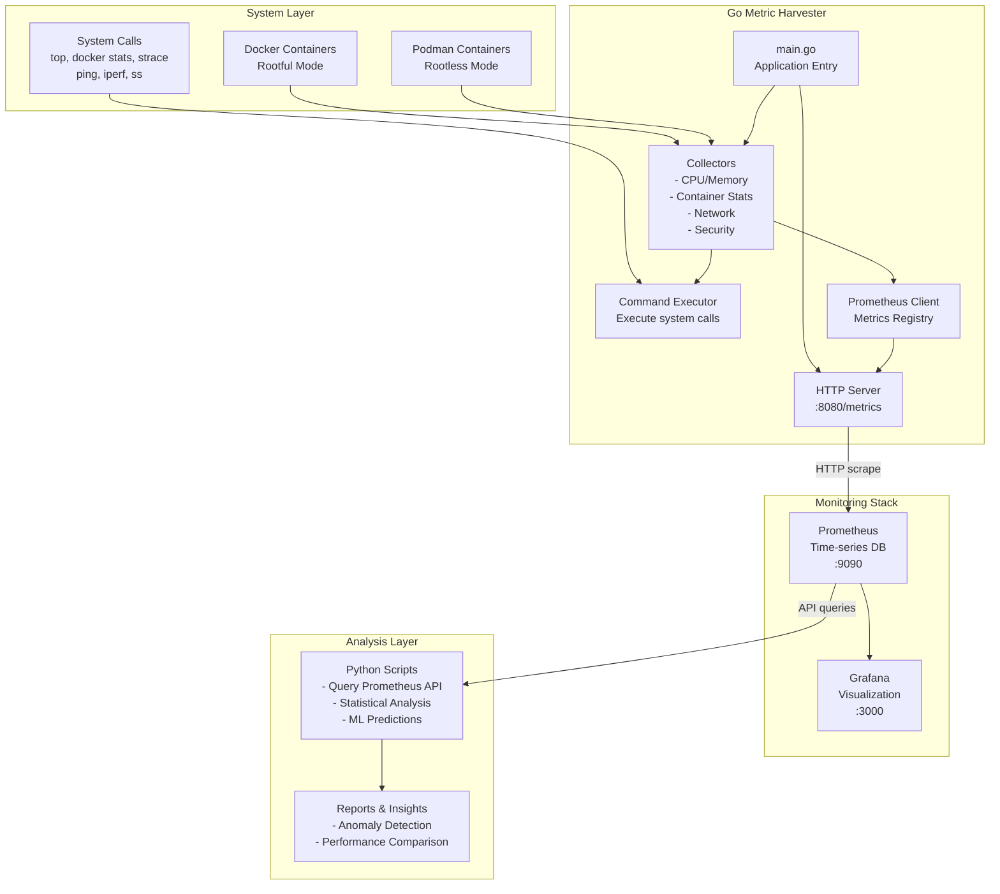

# Rootful vs Rootless Container Benchmarking Framework

A comprehensive benchmarking and security evaluation framework for comparing rootful vs rootless containers (Docker & Podman) using real workloads and system metrics.

## Architecture Overview



## Quick Start

### Prerequisites

- Go 1.21+
- Docker (for rootful container testing)
- Podman (for rootless container testing)
- Prometheus (optional, for metrics storage)
- Grafana (optional, for visualization)

### 1. Build and Run the Metric Harvester

```bash
cd metric_harvester/
go mod tidy
go build -o metric_harvester .
./metric_harvester
```

The application will start and expose metrics on `http://localhost:8080/metrics`

### 2. Test the Endpoints

```bash
# Health check
curl http://localhost:8080/health

# Application info
curl http://localhost:8080/info

# Prometheus metrics
curl http://localhost:8080/metrics
```

### 3. Set up Prometheus (Optional)

```bash
# Download Prometheus
wget https://github.com/prometheus/prometheus/releases/download/v2.45.0/prometheus-2.45.0.darwin-amd64.tar.gz
tar xvfz prometheus-2.45.0.darwin-amd64.tar.gz
cd prometheus-2.45.0.darwin-amd64/

# Use the provided configuration
cp ../prometheus.yml .

# Start Prometheus
./prometheus --config.file=prometheus.yml --storage.tsdb.path=./data
```

Prometheus will be available at `http://localhost:9090`

### 4. Set up Grafana (Optional)

```bash
# Install Grafana (macOS)
brew install grafana

# Start Grafana
brew services start grafana
```

Grafana will be available at `http://localhost:3000` (admin/admin)

## 📊 Available Metrics

### System Metrics
- `system_cpu_usage_percent{type="user|system|idle"}` - CPU usage by type
- `system_memory_usage_bytes{type="total|used|free|available"}` - Memory usage
- `system_disk_usage_bytes{device="...",type="used|available|total"}` - Disk usage
- `system_uptime_seconds` - System uptime

### Container Metrics
- `container_cpu_usage_percent{container="...",runtime="docker|podman"}` - Container CPU
- `container_memory_usage_bytes{container="...",runtime="docker|podman",type="used|limit"}` - Container memory
- `container_network_io_bytes{container="...",runtime="docker|podman",direction="rx|tx"}` - Container network I/O
- `container_block_io_bytes{container="...",runtime="docker|podman",direction="read|write"}` - Container disk I/O
- `container_running{container="...",runtime="docker|podman"}` - Container status

### Network Metrics
- `network_interface_rx_bytes_total{interface="..."}` - Interface received bytes
- `network_interface_tx_bytes_total{interface="..."}` - Interface transmitted bytes
- `network_interface_rx_packets_total{interface="..."}` - Interface received packets
- `network_interface_tx_packets_total{interface="..."}` - Interface transmitted packets
- `network_interface_rx_errors_total{interface="..."}` - Interface receive errors
- `network_interface_tx_errors_total{interface="..."}` - Interface transmit errors
- `network_interface_rx_dropped_total{interface="..."}` - Interface dropped received packets
- `network_interface_tx_dropped_total{interface="..."}` - Interface dropped transmitted packets
- `network_interface_up{interface="..."}` - Interface status (1=up, 0=down)
- `network_ping_latency_milliseconds{target="..."}` - Ping latency to target
- `network_ping_packet_loss_percent{target="..."}` - Ping packet loss percentage
- `network_ping_reachable{target="..."}` - Target reachability (1=reachable, 0=unreachable)

## 🔧 Configuration

The application is configured via JSON file `internal/config/configurations.json`:

```json
{
  "server": {
    "port": ":8080",
    "read_timeout": "10s",
    "write_timeout": "10s", 
    "shutdown_timeout": "30s"
  },
  "metrics": {
    "collection_interval": "15s",
    "command_timeout": "10s",
    "enable_system_metrics": true,
    "enable_container_metrics": true,
    "enable_network_metrics": true
  },
  "containers": {
    "docker_enabled": true,
    "podman_enabled": true,
    "monitored_names": [],
    "ignored_names": []
  },
  "network": {
    "ping_targets": ["8.8.8.8", "1.1.1.1", "google.com"],
    "monitor_loopback": false,
    "ignored_interfaces": []
  },
  "benchmarking": {
    "workloads_path": "./workloads",
    "results_path": "./results", 
    "max_concurrency": 10,
    "test_duration": "5m"
  },
  "logging": {
    "level": "info",
    "format": "json"
  }
}
```

**Configuration Options:**
- **Server**: HTTP server settings and timeouts
- **Metrics**: Collection intervals and feature toggles
- **Containers**: Docker/Podman monitoring settings and filters
- **Network**: Ping targets and interface filtering
- **Benchmarking**: Future benchmarking framework settings
- **Logging**: Log level and format configuration

## 🧪 Experimental Workflows

### 1. Basic Performance Comparison
```bash
# Start metric harvester
./metric_harvester &

# Run identical workloads in Docker (rootful) and Podman (rootless)
docker run -d --name nginx-docker nginx:alpine
podman run -d --name nginx-podman nginx:alpine

# Monitor metrics for comparison
curl http://localhost:8080/metrics | grep container_cpu_usage_percent
```

### 2. Security Isolation Testing
```bash
# Test privilege escalation attempts
docker run --rm -it alpine sh -c "whoami && id && ls -la /etc/shadow"
podman run --rm -it alpine sh -c "whoami && id && ls -la /etc/shadow"
```

### 3. Port Binding Restrictions
```bash
# Try binding to privileged ports
docker run -p 80:80 nginx:alpine  # Should work
podman run -p 80:80 nginx:alpine  # May fail without special config
```

### 4. Resource Limitation Testing
```bash
# Apply resource constraints
docker run --cpus="0.5" --memory="128m" stress:latest
podman run --cpus="0.5" --memory="128m" stress:latest

# Monitor resource usage
watch "curl -s http://localhost:8080/metrics | grep -E '(cpu|memory)_usage'"
```

## 📈 Data Analysis

### Using Python for Advanced Analysis

```python
import requests
import pandas as pd
from datetime import datetime

# Query Prometheus API
def get_metrics(query):
    url = f'http://localhost:9090/api/v1/query'
    params = {'query': query}
    response = requests.get(url, params=params)
    return response.json()

# Compare CPU usage between Docker and Podman
docker_cpu = get_metrics('container_cpu_usage_percent{runtime="docker"}')
podman_cpu = get_metrics('container_cpu_usage_percent{runtime="podman"}')

# Perform statistical analysis
# ... (implement your analysis logic)
```

### Sample Grafana Queries

```promql
# Average CPU usage by runtime
avg by (runtime) (container_cpu_usage_percent)

# Memory usage comparison
container_memory_usage_bytes{type="used"} / container_memory_usage_bytes{type="limit"} * 100

# Container network I/O rate
rate(container_network_io_bytes[5m])

# System network interface throughput
rate(network_interface_rx_bytes_total[5m]) + rate(network_interface_tx_bytes_total[5m])

# Network connectivity health
avg by (target) (network_ping_reachable)

# Network latency trends
avg by (target) (network_ping_latency_milliseconds)
```

## 🔍 Troubleshooting

### Common Issues

1. **Command timeouts**: Increase `CommandTimeout` in config
2. **Docker not found**: Ensure Docker daemon is running
3. **Podman not found**: Install Podman or disable in config
4. **Permission denied**: Some system commands may need elevated privileges

### Debug Mode

Set log level to debug for more detailed output:
```go
config.Logging.Level = "debug"
```

## 🎯 Next Steps

1. **Extend Collectors**: Add more specialized metrics (network latency, I/O throughput)
2. **Benchmarking Suite**: Implement automated benchmark scenarios
3. **Security Analysis**: Add security-specific metrics and tests
4. **Alerting**: Set up Prometheus alerts for anomalies
5. **Dashboard**: Create comprehensive Grafana dashboards
6. **ML Analysis**: Implement anomaly detection and performance prediction

## 📝 Contributing

1. Fork the repository
2. Create a feature branch
3. Add tests for new functionality
4. Submit a pull request

## 📄 License

This project is licensed under the MIT License.